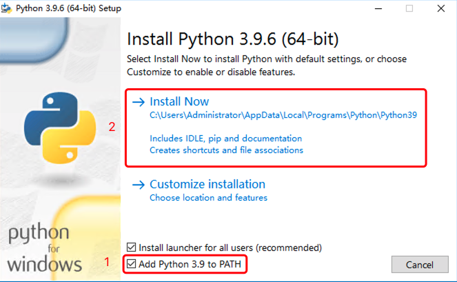
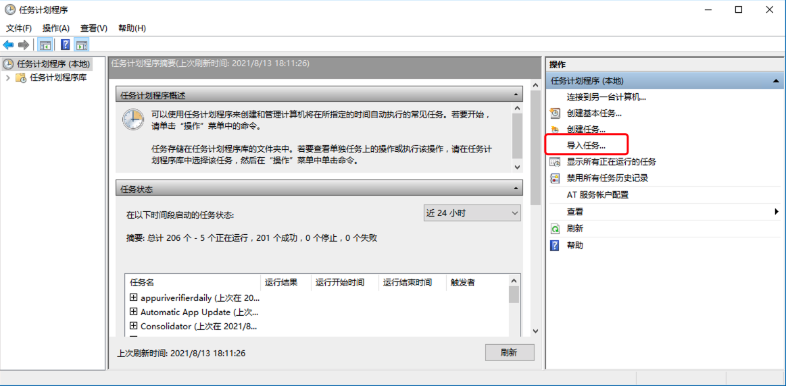
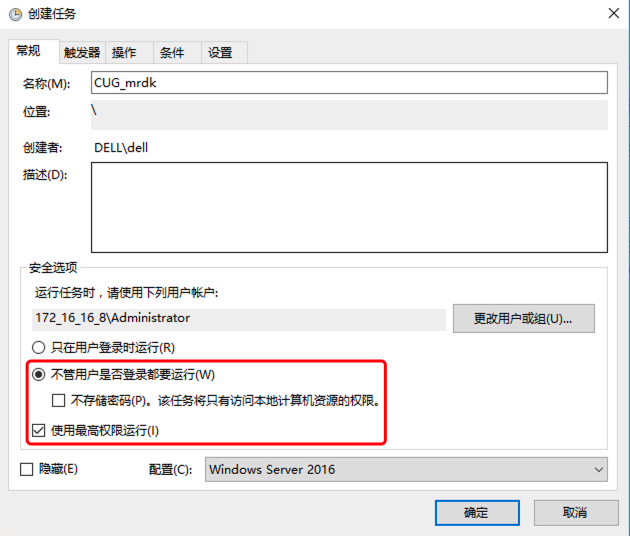
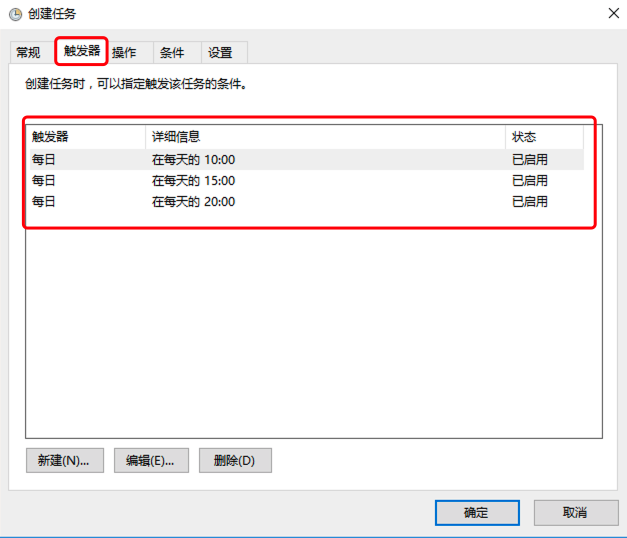
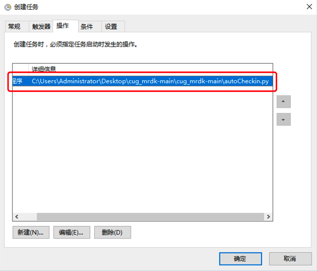
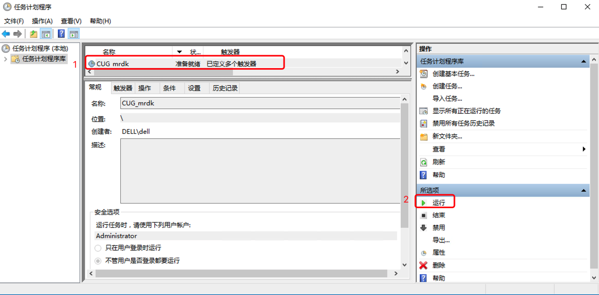

# cug_mrdk
### 每日健康打卡脚本

我们应当积极配合政府和学校的防疫政策，代码不是为了规避防疫政策而写，而是为了简化重复的填报操作。如遇到身体不适和信息变动，还应当手动更新填报信息，主动报备。

### 目录

- [简介](#简介)
- [使用](#使用)
- [二次开发](#二次开发)


## 简介

每日健康打卡批处理脚本使用Python语言编写，主要功能是登录数字校园门户并提交每日健康打卡请求。配合windows系统中的任务计划程序可实现每天固定的三次自动打卡，无需手动干预。经测试在Windows10和macOS11下正常运行。如果使用过程中有任何问题都可在Issues中给我留言。
每日打卡的四个必填选项默认如下，可在代码中修改。


## 使用

### 1.安装Python3

- python 3.9.6下载地址https://www.python.org/ftp/python/3.9.6/python-3.9.6-amd64.exe




### 2.pip安装Python3相关依赖库

在cmd中输入，然后等待依赖库下载并安装完成

```shell
pip3 install -r 'requirements.txt的路径'
```

- Pillow  图像处理
- pytesseract  识别验证码
- requests  提交http请求
- scipy  数值计算
- selenium  浏览器模拟
- urllib3  网络通信

### 3.安装tesseract验证码OCR程序

- tesseract下载地址https://digi.bib.uni-mannheim.de/tesseract/tesseract-ocr-w64-setup-v5.0.0.20190623.exe

全部默认选项安装，安装路径可以自定义并记录下来，以便后面参数配置

### 4.配置参数

使用文本编辑器打开parameters.cfg文件

- 修改Tesseract：上一步中tesseract.exe的路径
- 修改数字校园门户用户名UserName
- 修改密码PassWord

```shell
[Path]
# 日志文件路径
LogPath = log.txt
# tesseract.exe安装路径(windows)
Tesseract = D:/Program Files/Tesseract-OCR/tesseract.exe

[Parameter]
# 数字校园门户用户名
UserName = 1202010000
# 密码
PassWord = 123456
```

### 5.设置任务计划程序

键盘键入windows+R打开运行，然后输入“control schedtasks”，点击确定，打开任务计划程序



点击“导入任务”，选择“CUG_mrdk.xml”文件





确认相关选项设置，打开“操作”标签页，双击修改运行命令为“autoCheckin.py”文件所在路径，然后点击右下角“确定”按钮输入密码，保存设置



选中设置好的任务计划程序“CUG_mrdk”，点击运行，测试是否正常



在程序根目录的“log.txt”文件中可以查看日志

## 二次开发

- main.py
  - V1.0 一次性批量提交若干天的打卡请求
- autoCheckin.py
  - V2.0 每天自动定时提交打卡请求 
